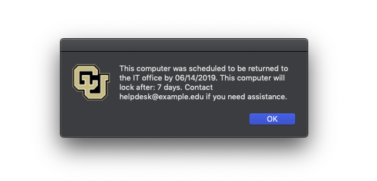
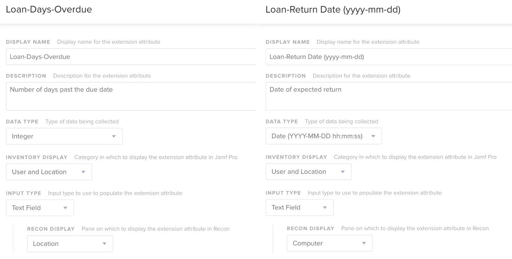

# Due Date
This is a script used in conjunction with JAMF to "encourage" users to return loaned laptops on time. This project served as a learning experience. It extends working knowledge on scripts and API calls I used after completing the JAMF 300 certification course.

It became necessary to implement some sort of automatic notification system after I had loaned out over ten laptops. Keeping track of dates in JAMF and emailing users when their loan period expired was needlessly complicated. I wanted to practice using API calls to perform some sort of task based on data from my JAMF Pro server. 

## How does it work?

When a laptop is loaned to a user, their username and the agreed upon return date are saved to the asset in JAMF Pro. 

If the laptop is not reutned by that date, the logged in user is notified to return the laptop. After seven days the laptop is locked and if a user hasn't returned the laptop within the grace period they always have returned a locked laptop.

If the laptop is not past it's due date the script just executes and submits a log to JAMF.

## Requirements

### Encrypted Strings
I've leaned on several existing projects to implement some of the encryption elements, thanks [brysontyrrell](https://github.com/brysontyrrell/EncryptedStrings) for creating the quick method for encryption. EncryptedStrings are used to authenticate to the JAMF API during various parts of the script.

### Extension Attribute Requirements
Two extension attributes are required. The first extension attribute tracks the number of days any given laptop is past it's due date. The other extension attribute stores the due date of a laptop. It's necessary to grab the ID of both of those extension attributes and assign that ID value within this script.

The grace period extension attribute can track a simple integer data type. The return date extension attribute should collect date in the (yyyy-mm-dd) format. Examples below:

### Policy Requirements
A JAMF policy which runs the script once a day, on your set of loaner laptops. The script requires at that you at least pass the API password and lock code from this policy.

### API Requirements
You need to set an API account with access to at least view and modify computers for the script to be able to interact with the values. I'm just passing the username of my API account into the script itself. The password is encoded using the EncryptedStrings project linked above. 
